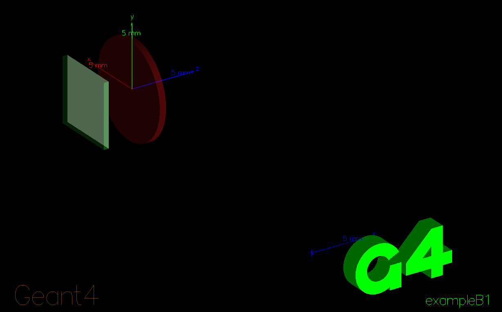

<h1 align="center">RISQ2 G4CMP Introductory Tutorial</h1>

Assembled by Jesse Lutz, jjlutz@sandia.gov

This tutorial is meant to guide the user through their first steps of using G4CMP. We focus here on a geometry representing the experimental setup used by Vepsäläinen et al. in their 2020 Nature paper entitled ["Impact of ionizing radiation on superconducting qubit coherence"](https://doi.org/10.1038/s41586-020-2619-8) (as developed from the basic Geant4 example B1 by Adam Hect and I).

As a disclaimer, it is expected that you have already installed Geant4 and G4CMP and know how to compile an application (if not, see the instructions in the main `README` or click the following [YouTube video](https://www.youtube.com/watch?v=D1ZfUewM8-E). Please note that later parts of this tutorial also require that is ROOT installed, which is available free for download from [CERN](root.cern).

<section> 
  <h2>Part 1: How can I adapt an existing Geant4 application for G4CMP?</h2>
  <p></p>
</section>

A common problem facing new G4CMP users is how to adapt an existing Geant4 application for use with G4CMP. As an example of how to do this, let's step through the procedure to adapt a Geant4 application included in this directory (`B1_working_Nature_device.zip`). There is no need to unzip the file unless you want to look at the original application. Please note as you read through the following that these changes (and many more) have already been made in the application contained in the base directory. You do not have to adapt `B1_working_Nature_device.zip` but it is included here in case you want the practice. If you just want to compile the code and move on to the next part, scroll down stopping just before "Part 2".

Adapting a Geant4 application for G4CMP involves loading the G4CMP physics list, directing the program to the G4CMP header files, and assigning a lattice to a material wherein condensed-phase processes will occur. Let's start by assigning a lattice to the silicon material in `B1DetectorConstruction.cc`. Opening that file, we need to add necessary preprocessor directives,
```python
#include "G4MaterialPropertiesTable.hh"
#include "G4LatticeManager.hh"
#include "G4LatticePhysical.hh"
```
declare lattice-related variables in the constructor 
```python
B1DetectorConstruction::B1DetectorConstruction()
: G4VUserDetectorConstruction(),
  latManager(G4LatticeManager::GetLatticeManager()),
  latticePhysical(nullptr),
  Silicon(nullptr),
  fScoringVolume(0){}
```
and prepare to clean up the lattice in the destructor.

```python
B1DetectorConstruction::~B1DetectorConstruction(){
  if (latticePhysical) {
    delete latticePhysical; // Free the allocated memory
    latticePhysical = nullptr; // Set the pointer to nullptr to avoid dangling pointer
  }}
```
Scrolling down to where we define the physical volume associated with the Si, immediately after we will define the Si composition,

```python
    G4double density = 2.33 * g/cm3;
    G4int ncomponents = 1;
    G4Element* elSi = nist->FindOrBuildElement("Si");
    Silicon = new G4Material("Silicon", density, ncomponents);
    Silicon->AddElement(elSi, 1.0);
```
define a lattice manager and load the Si lattice,

```python
    latManager = G4LatticeManager::GetLatticeManager();
    latManager->LoadLattice(Silicon, "Si");
```
and attach the Si lattice to the Si physical volume 

```python
    G4LatticePhysical* latticeSi = new G4LatticePhysical(latManager->GetLattice(Silicon));
    latticeSi->SetMillerOrientation(1, 0, 0, 0.*deg);
    latManager->RegisterLattice(physSi, latticeSi);
```
Note that one must specify Miller indeces to set the crystal orientation here.
Finally, we declare member variables and functions in `B1DetectorConstruction.hh`:

```python
  private:
    void AttachLattice(G4VPhysicalVolume* pv);
    G4LatticeManager* latManager;
    G4LatticePhysical* latticePhysical;
    G4Material* Silicon; 
    G4LogicalVolume*  fScoringVolume;
```
Let's move on to changes in the `main()` function. First, we need a few preprocessor directives

```python
#include "chargeConfigManager.hh"
#include "G4CMPStackingAction.hh"
#include "G4CMPConfigManager.hh"
#include "G4CMPPhysicsList.hh"
#include "G4VModularPhysicsList.hh"
#include "G4CMPPhysics.hh"
#include "B1ActionInitialization.hh"
```
After defining the physics list, add the G4CMP physics list to the Geant4 one

```python
physicsList->RegisterPhysics(new G4CMPPhysics);
```
After user action initialization, instantiate G4CMP configuration manager (enables macro commands)

```python
  G4CMPConfigManager::Instance();
```
<section> 
  <h2>Build the code</h2>
  <p></p>
</section>
Create a build directory within the source directory, descend into it, and compile the program with

```bash
mkdir build
cd build
cmake ../
make
```



You can see the geometry setup by running the program with the original visualization macro
```bash
./exampleB1 init_vis.mac
```
The geometry we use here is meant to mimic the Vepsäläinen setup, which was a copper housing disk containing a superconducting qubit of Al on Si (200 nm on 280 𝜇m) with lateral dimensions 5 mm × 5 mm. The source is <sup>64</sup>Cu with 6.12 𝜇Ci activity, which emits 𝛽+ (653 keV; 17.49%), 𝛽− (580 keV; 38.5%), and 𝛾 particles (1346 keV; 0.472%), and it emits istropically from the Cu volume. While our original application included all that physics (including 𝛽 emission via a triangle distribution of eneriges), for the purposes of this tutorial things have been simplified considerably: the particle gun fires only 𝛽− particles at a fixed energy of 100 keV and a fixed distance of about 350 𝜇m. 
<section> 
  <h2>Part 2: Let's track electrons in our application.</h2>
  <p></p>
</section>
In radiation-impact studies of superconducting qubits, electrons incident on the Si/Al interface are a useful intermediate observable because they help quantify how energy deposited by ionizing radiation in the device substrate can be transported to the superconducting film, where it may ultimately contribute to nonequilibrium excitations. In the geometry studied here, the aluminum layer is extremely thin compared with the silicon substrate—about 200 nm of Al on 280 μm of Si—so most of the radiation energy is deposited in the silicon rather than directly in the superconductor. As a result, understanding how condensed-matter charge carriers propagate through the substrate and arrive at the Si/Al boundary is an important first step in connecting microscopic transport physics to experimentally relevant qubit degradation mechanisms. Electrons that reach this interface represent a channel by which substrate-deposited energy can be transferred toward the superconducting metal, where later stages of the cascade may generate phonons and quasiparticles that degrade qubit coherence and increase relaxation rates.

Run the code with 
```bash 
./exampleB1 g4cmp_electrons.mac > g4cmp_electrons.out
```
where the `g4cmp_electrons.mac` macro is:
```python
/run/initialize
/control/verbose 2
/run/verbose 2
/event/verbose 0
/tracking/verbose 1

/analysis/setSpecies electrons
/g4cmp/samplingEnergy 100 eV

/g4cmp/producePhonons 0.
/g4cmp/produceCharges 1.
/g4cmp/sampleLuke 0.
/g4cmp/minEPhonons 1 MeV

/g4cmp/eTrappingMFP 100 um
/g4cmp/hTrappingMFP 100 um

/run/beamOn 100
```
In the first block we initialize and set verbosity. In the second block, we specify we are tracking electrons (this is an application specific macro command) and set the sampling energy as 100 eV. The downsampling energy is a kind of "biasing" (in the Geant4 sense) which we use for efficiency.  When you set a sampling energy, that tells you how many _tracked_ charge pairs will be created.  Each of those will be weighted by the ratio of your true energy to the sampling scale.  For a 10 keV energy deposit, for example, 100 eV sampling means each e/h pair will have a weight of 100 (i.e., 10 keV/100 eV).

In the third block, one should note that phonons were omitted/killed from this simulation. This was done simply to expedite the collection of statistics for electrons. The fourth block controls the electron and hole trapping mean free path values.  We will vary these momentarily to see their effect on the charge dynamics. Finally, we specify 100 shots here to obtain results quicky, but with less accurate statistics. I changed the number of shots to 1000 for comiling the plots below; it ran in 5 minutes on my machine. 

Once the code has finished running, we will use ROOT to launch a plotting script called `g4cmp_electron_interface_hits.C`,

```bash
root -l g4cmp_electron_plot_interface_hits.C
```

which produces the figures `event_summary.png` and `interface_hits_summary.png` shown below.


The preceding figure shows the event-by-event distribution of the fraction of electrons that reach the Si/Al interface, f<sub>reach</sub> = N<sub>reach</sub> / N<sub>in Si</sub>. This quantity summarizes the transport efficiency of the electron population within the silicon substrate for each simulated event. A higher value of ​f<sub>reach</sub> indicates that a larger fraction of generated conduction-band electrons survive scattering and trapping processes long enough to reach the interface, while a lower value indicates stronger loss to trapping in the silicon. This event-level observable is useful because it condenses the detailed carrier-transport dynamics into a single parameter that can later be connected to energy transfer into the aluminum and, in more advanced stages of the tutorial, to phonon and quasiparticle generation.


The preceding figure summarizes the properties of `G4CMPDriftElectron` carriers that reach the Si/Al interface. The upper-left panel shows the distribution of electron kinetic energies at the interface, illustrating the range of carrier transport energies with which electrons arrive at the superconducting film boundary. The upper-right panel shows the distribution of the interface-normal velocity component  v<sub>⊥</sub>, which characterizes how strongly the electrons are moving toward the interface at the moment of arrival. The lower-left panel shows the arrival-time distribution, indicating the timescale over which the electron population reaches the boundary following the initial radiation event. The lower-right panel is a two-dimensional map of hit positions in the interface plane, showing the spatial distribution of where electrons encounter the Si/Al boundary. Together, these panels provide a compact microscopic description of electron transport in the silicon substrate and the subset of carriers that can deliver energy to the superconducting film.

Let's now open the `g4cmp_electrons.mac` file, change the trapping mean free path value, and see how it affects the results.

```bash
/g4cmp/eTrappingMFP 300 um
```

and rerun. Varying this parameter changes the electron dynamics in the substrate considerably.  Note that the peak of the electron fraction distribution has shifted signifacntly, from about 0.25 to about 0.5. Other properties are affected. Comparing the arrival time histograms, we see that the drift electrons can now take twice as long to arrive at the interface. Indeed, the radial distribution has a much larger radius since the particles can undergo longer random walks without being trapped. 


This section illustrated the importance of the trapping mean free path parameter. While there are other parameters governing the underlying physics of drift electrons and holes, they are less material dependent and therefore known with more certainty.  What we have not addressed in this tutorial is surface physics. G4CMP allows the user to define the `???`

<section> 
  <h2>Part 3: Let's track phonons in our application.</h2>
  <p></p>
</section>

The real agents of Cooper-pair breaking (and therefore quasiparticle poisoning) are the phonons, not the electrons. Let's change our focus to phonons now and perform the same analysis. It should be reiterated that because the Al layer is so thin the majority of phonons will be generated in the Si substrate. Thus one of the first things one might model is the rate and distribution of arrival of phonons of various flavors. Run the code with 
```bash 
./exampleB1 g4cmp_phonons.mac > g4cmp_phonons.out
```
where the `g4cmp_electrons.mac` macro is:
```python
/run/initialize
/control/verbose 2
/run/verbose 2
/event/verbose 0
/tracking/verbose 1

/analysis/setSpecies phonons
/g4cmp/samplingEnergy 100 eV

/g4cmp/producePhonons 1.
/g4cmp/produceCharges 1.
/g4cmp/sampleLuke 1.
/g4cmp/minEPhonons 0.05 eV

/g4cmp/eTrappingMFP 300 um
/g4cmp/hTrappingMFP 100 um

/run/beamOn 100
```
where we note that we have set the species tracked to be phonon instead of electron. The 100 shots took about 10 minutes on my machine, so dial that down if necessary. You can see how this toggle behavior works in the following block within the stepping action. Here we map each accepted particle to a species identifier that is stored in the interface-hit ntuple and later used for ROOT-based visualization. 
```C++
auto config = B1AnalysisConfig::Instance();

G4bool acceptTrack = false;
G4int speciesID = -1;

if (config->IsElectronMode()) {
  if (particleName == "G4CMPDriftElectron") {
    acceptTrack = true;
    speciesID = 0;
  }
}
else if (config->IsPhononMode()) {
  if (particleName == "phononL") {
    acceptTrack = true;
    speciesID = 1;
  }
  else if (particleName == "phononTF") {
    acceptTrack = true;
    speciesID = 2;
  }
  else if (particleName == "phononTS") {
    acceptTrack = true;
    speciesID = 3;
  }
}

if (!acceptTrack) return;
```

