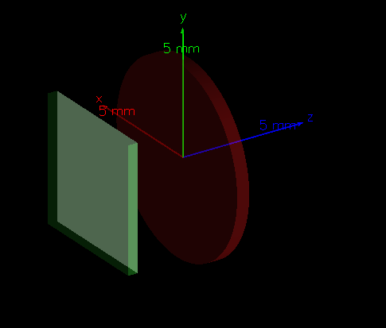
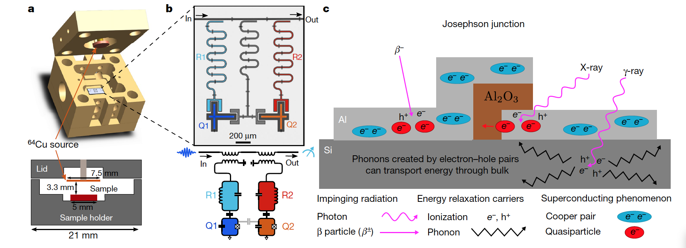
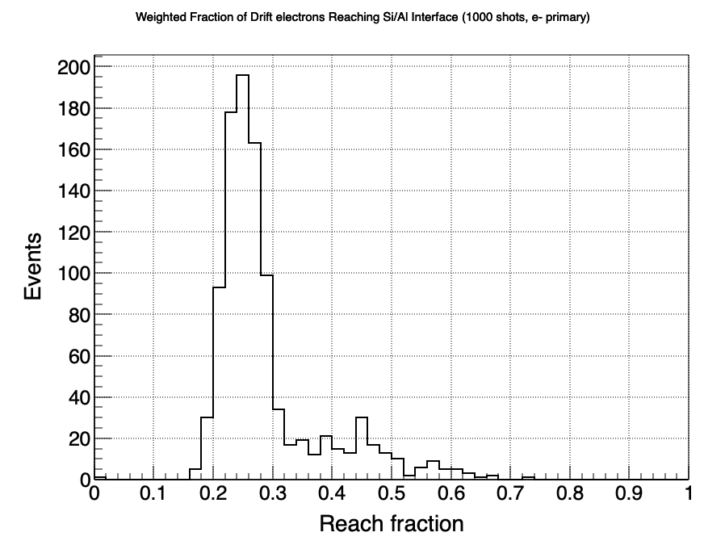
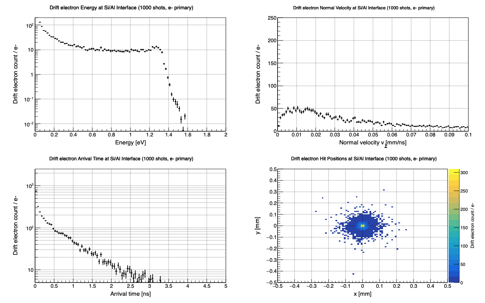
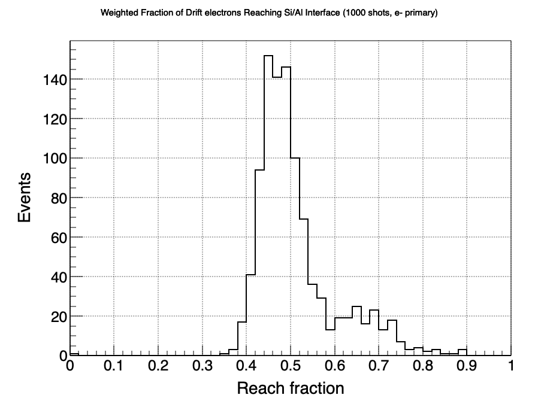
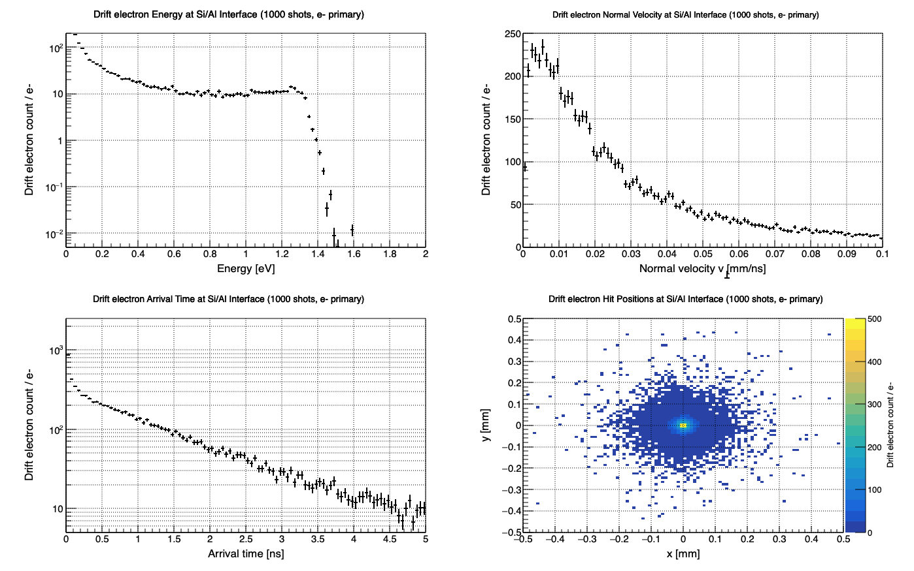
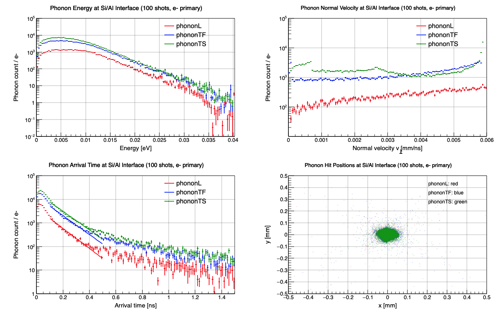
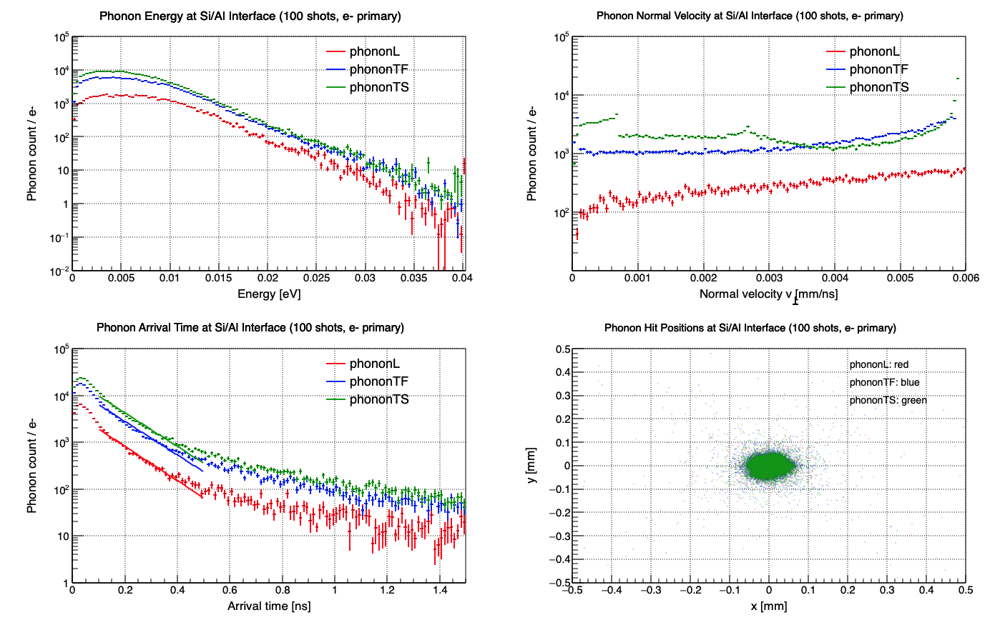
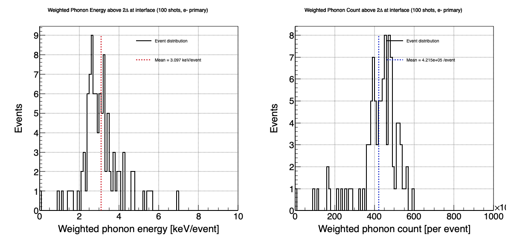

<h1 align="center">RISQ2 G4CMP Introductory Tutorial</h1>

### Assembled by Jesse Lutz ([jjlutz@sandia.gov](jjlutz@sandia.gov))

This tutorial is meant to guide the user through their first steps with G4CMP. Our example geometry is based on the experimental setup used by Vepsäläinen et al. in their 2020 Nature paper, ["Impact of ionizing radiation on superconducting qubit coherence"](https://doi.org/10.1038/s41586-020-2619-8) The original Geant4 application included in the cwd grew out of the Geant4 basic example B1. It was developed with Prof. Adam Hecht (University of New Mexico).

Before getting started, we assume that you have already installed Geant4 and G4CMP and know how to compile an application (if not, please see the instructions in their respective README files or follow this [YouTube video](https://www.youtube.com/watch?v=D1ZfUewM8-E)). Please note that later parts of this tutorial also require ROOT, which is available free of charge from [CERN](root.cern). Also, before running anything, make sure your environment is initialized:
```bash
source $G4INSTALL/../../bin/geant4.sh
source $G4CMPINSTALL/g4cmp_env.sh
```

This tutorial is organized into four sections. The first, which is optional, gives a description of how to incorporate G4CMP into an existing Geant4 application.  While this is important information for new users, we do not launch the tutorial program until Part 2.  In Parts 2 and 3 we investigate electron and phonon dynamics, respectively. Finally, in Part 4 we make a conceptual connection between our simulations, quasiparticles, and the Vepsäläinen study.

<section> 
  <h2>Part 1: Adapting an existing Geant4 application for G4CMP</h2>
  <p></p>
</section>

One of the first challenges many new G4CMP users encounter is figuring out how to adapt an existing Geant4 application for use with G4CMP. To make that process concrete, we will first step through the adaptation of a Geant4 application included in the current working directory (`B1_working_Nature_device.zip`). You do not need to unzip this file unless you want to inspect the original application. 

As you read through the steps below, keep in mind that these changes—and several others—have already been made in the application contained in the base directory. You do not need to adapt `B1_working_Nature_device.zip` yourself unless you want the practice. If you would rather compile the code and move straight to the next part, scroll down to the section heading "Build the Tutorial Example" just before "Part 2".

At a high level, adapting a Geant4 application for G4CMP means loading the G4CMP physics list, pointing the program to the appropriate G4CMP header files, and assigning a lattice to any material in which condensed-phase processes will occur. We will start by assigning a lattice to the silicon material in `B1DetectorConstruction.cc`. To that file one would need to add necessary preprocessor directives,
```python
#include "G4MaterialPropertiesTable.hh"
#include "G4LatticeManager.hh"
#include "G4LatticePhysical.hh"
```
declare lattice-related variables in the constructor 
```python
B1DetectorConstruction::B1DetectorConstruction()
: G4VUserDetectorConstruction(),
  latManager(G4LatticeManager::GetLatticeManager()),
  latticePhysical(nullptr),
  Silicon(nullptr),
  fScoringVolume(0){}
```
and prepare to clean up the lattice in the destructor.

```python
B1DetectorConstruction::~B1DetectorConstruction(){
  if (latticePhysical) {
    delete latticePhysical; // Free the allocated memory
    latticePhysical = nullptr; // Set the pointer to nullptr to avoid dangling pointer
  }}
```
Scrolling down to where we define the physical volume associated with the Si, immediately after we will define the Si composition,

```python
    G4double density = 2.33 * g/cm3;
    G4int ncomponents = 1;
    G4Element* elSi = nist->FindOrBuildElement("Si");
    Silicon = new G4Material("Silicon", density, ncomponents);
    Silicon->AddElement(elSi, 1.0);
```
define a lattice manager and load the Si lattice,

```python
    latManager = G4LatticeManager::GetLatticeManager();
    latManager->LoadLattice(Silicon, "Si");
```
and attach the Si lattice to the Si physical volume 

```python
    G4LatticePhysical* latticeSi = new G4LatticePhysical(latManager->GetLattice(Silicon));
    latticeSi->SetMillerOrientation(1, 0, 0, 0.*deg);
    latManager->RegisterLattice(physSi, latticeSi);
```
Note that one must specify Miller indices to set the crystal orientation here.
Finally, we declare member variables and functions in `B1DetectorConstruction.hh`:

```python
  private:
    void AttachLattice(G4VPhysicalVolume* pv);
    G4LatticeManager* latManager;
    G4LatticePhysical* latticePhysical;
    G4Material* Silicon; 
    G4LogicalVolume*  fScoringVolume;
```
Let's move on to changes in the `main()` function. First, we need a few preprocessor directives

```python
#include "chargeConfigManager.hh"
#include "G4CMPStackingAction.hh"
#include "G4CMPConfigManager.hh"
#include "G4CMPPhysicsList.hh"
#include "G4VModularPhysicsList.hh"
#include "G4CMPPhysics.hh"
#include "B1ActionInitialization.hh"
```
After defining the physics list, add the G4CMP physics list to the Geant4 one

```python
physicsList->RegisterPhysics(new G4CMPPhysics);
```
After user action initialization, instantiate G4CMP configuration manager (enables macro commands)

```python
  G4CMPConfigManager::Instance();
```
<section> 
  <h2>Build the Tutorial Example</h2>
  <p></p>
</section>

Now we're ready to see what the tutorial application can do. Create a build directory within the source directory, descend into it, and compile the program with

```bash
mkdir build
cd build
cmake ../
make
```



You can inspect the geometry setup by running the program with the original visualization macro
```bash
./g4beginner init_vis.mac
```
The geometry used here is meant to mimic the setup studied by Vepsäläinen et al.: a copper source disk above a superconducting aluminum structure on a silicon substrate (200 nm of Al on 280 μm of Si) with lateral dimensions 5 mm x 5 mm. The source is $^{64}\mathrm{Cu}$ with an activity of $6.12\,\mu\mathrm{Ci}$. It emits $\beta^+$ particles (653 keV; 17.49%), $\beta^-$ particles (580 keV; 38.5%), and \(\gamma\) rays (1346 keV; 0.472%), with emission taken to be isotropic from the Cu volume. The original application included all of this physics, including $\beta$ emission sampled from a triangular energy distribution. For the purposes of this tutorial, however, we simplify things considerably: the particle gun fires only $\beta^-$ particles, at a fixed energy of 100 keV and from a fixed distance of about $350\,\mu\mathrm{m}$. As a visual aid, Fig. 1 from the paper is reproduced below:


<section> 
  <h2>Part 2: Let's track electrons in our application.</h2>
  <p></p>
</section>
In radiation-impact studies of superconducting qubits, electrons incident on the Si/Al interface are a useful intermediate observable because they help quantify how energy deposited by ionizing radiation in the substrate can be transported to the superconducting film, where it may ultimately contribute to nonequilibrium excitations. In the geometry studied here, the aluminum layer is extremely thin compared with the silicon substrate—about 200 nm of Al on 280 μm of Si—so most of the radiation energy is deposited in the silicon rather than directly in the superconductor. As a result, understanding how condensed-matter charge carriers propagate through the substrate and arrive at the Si/Al boundary is an important first step toward connecting microscopic transport physics to experimentally relevant qubit degradation mechanisms. Electrons that reach this interface represent one channel by which substrate-deposited energy can be transferred toward the superconducting metal, where later stages of the cascade may generate phonons and quasiparticles that degrade qubit coherence and increase relaxation rates.

Run the code with 
```bash 
./g4beginner g4cmp_electrons_100um.mac > g4cmp_electrons_100um.out
```
where the `g4cmp_electrons_100um.mac` macro is:
```python
/run/initialize
/control/verbose 2
/run/verbose 2
/event/verbose 0
/tracking/verbose 1

/analysis/setSpecies electrons
/g4cmp/samplingEnergy 100 eV

/g4cmp/producePhonons 0.
/g4cmp/produceCharges 1.
/g4cmp/sampleLuke 0.
/g4cmp/minEPhonons 1 MeV

/g4cmp/eTrappingMFP 100 um
/g4cmp/hTrappingMFP 100 um

/run/beamOn 100
```
In the first block, we initialize the run and set the verbosity level. In the second block, we specify that we are tracking G4CMP drift electrons (this is an application-specific macro command) and set the downsampling energy to 100 eV. The downsampling energy acts as a form of biasing, in the Geant4 sense, and is used here to improve computational efficiency. When you set a downsampling energy, you are effectively setting how many *tracked* charge pairs will be created in the simulation. Each of those tracked pairs is then assigned a weight equal to the ratio of the true deposited energy to the downsampling scale. For example, for a 10 keV energy deposit, a downsampling energy of 100 eV means each tracked electron-hole pair will carry a weight of 100, since $10\,\mathrm{keV}/100\,\mathrm{eV} = 100$.

In the third block, note that phonons are omitted (or killed) in this simulation. This is done simply to speed up the collection of electron statistics. The fourth block controls the mean free paths for electron and hole trapping. We will vary these momentarily to see how they affect the charge dynamics. Finally, we use 100 shots here to obtain results quickly, with the tradeoff of poorer statistics. For the plots shown below, I increased the number of shots to 1000; on my machine, that took about 5 minutes to run.

Once the code has finished running, we will use ROOT to launch a plotting script called `g4cmp_electron_interface_hits.C`,

```bash
cp g4cmp_electrons.root g4cmp_electrons_100um.root
root -l 'g4cmp_electrons_interface_hits.C("e-",100)'
```
where the arguments specify the primary particle type (here it is "e-") and the number of shots (from beamOn 100). Don't forget you can press ctrl+D (if on a mac) to exit ROOT. This produces two plots stored in the figures directory called `event_summary.png` and `interface_hits_summary.png` shown below. For future reference, I recommend you rename them to `event_summary_100um.png` and `interface_hits_summary_100um.png`, respectively.



The preceding figure shows the event-by-event distribution of the fraction of electrons that reach the Si/Al interface, $f_{\text{reach}} = N_{\text{reach}}/N_{\text{in Si}}$. This quantity summarizes the transport efficiency of the electron population within the silicon substrate for each simulated event. A higher value of $f_{\text{reach}}$ indicates that a larger fraction of generated conduction-band electrons survive scattering and trapping processes long enough to reach the interface, while a lower value indicates that more of them are lost to trapping in the silicon. This event-level observable is useful because it condenses the detailed carrier-transport dynamics into a single parameter that can later be connected to energy transfer into the aluminum and, in more advanced stages of the tutorial, to phonon and quasiparticle generation.



The preceding figure summarizes the properties of `G4CMPDriftElectron` carriers that reach the Si/Al interface. The upper-left panel shows the distribution of electron energies at the interface, illustrating the range of transport energies with which electrons arrive at the superconducting film boundary. The upper-right panel shows the distribution of the interface-normal velocity component  v<sub>⊥</sub>, which characterizes how strongly the electrons are moving toward the interface at the moment of arrival. The lower-left panel shows the arrival-time distribution, indicating the timescale over which the electron population reaches the boundary following the initial radiation event. The lower-right panel is a two-dimensional map of hit positions in the interface plane, showing where electrons encounter the Si/Al boundary. Taken together, these panels provide a compact microscopic picture of electron transport in the silicon substrate and of the subset of carriers that can deliver energy to the superconducting film.

Let's now see how changing the trapping mean free path value affects the results.  In the new macro, `g4cmp_electrons_300um.mac`, the only change is that `eTrappingMFP` is increased from 100 μm to 300 μm. Now run the simulation with the longer trapping mean free path, back up your new output, and run the plotting script again:

```bash
./g4beginner g4cmp_electrons_300um.mac > g4cmp_electrons_300um.out
cp g4cmp_electrons.root g4cmp_electrons_300um.root
root -l 'g4cmp_electrons_interface_hits.C("e-",100)'
```

Varying this parameter changes the electron dynamics in the substrate considerably.  Note that the peak of the electron fraction distribution has shifted significantly, from about 0.25 to about 0.5. Other properties are affected. Comparing the arrival time histograms, we see that the drift electrons can now take twice as long to arrive at the interface. Indeed, the radial distribution has a much larger radius since the particles can undergo longer random walks without being trapped. 





This section illustrated the importance of the trapping mean free path parameter. While there are other parameters governing the underlying physics of drift electrons and holes, they are less material dependent and therefore known with more certainty.  What we have not addressed in this tutorial is surface physics. G4CMP allows the user to define the reflection coefficients for a given surface or interface, and the transmission physics is currently being implemented.

<section> 
  <h2>Part 3: Let's track phonons in our application.</h2>
  <p></p>
</section>

The real agents of Cooper-pair breaking (and subsequent quasiparticle poisoning) are the phonons, not the electrons. Let's change our focus to phonons now and perform the same analysis. It should be reiterated that because the Al layer is so thin the majority of phonons will be generated in the Si substrate. Thus one of the first things one might model is the rate and distribution of arrival of phonons of various flavors. Run the code with 
```bash 
./g4beginner g4cmp_phonons_100um.mac > g4cmp_phonons_100um.out
```
where the `g4cmp_phonons_100um.mac` macro is:
```python
/run/initialize
/control/verbose 2
/run/verbose 2
/event/verbose 0
/tracking/verbose 1

/analysis/setSpecies phonons
/g4cmp/samplingEnergy 100 eV

/g4cmp/producePhonons 1.
/g4cmp/produceCharges 1.
/g4cmp/sampleLuke 1.
/g4cmp/minEPhonons 0.05 eV

/g4cmp/eTrappingMFP 100 um
/g4cmp/hTrappingMFP 100 um

/run/beamOn 100
```
where we set the species tracked to be phonon instead of electron. The 100 shots took about 10 minutes on my machine; dial that down if necessary. As a reminder, back up your data and figures as they are generated. Plot the data

```bash 
root -l 'g4cmp_phonons_interface_hits.C("e-",100)'
``` 
again specifying as arguments the type of primary particle and the number of shots. This should produce the following collection of plots



From this we can compare the behavior of the various flavors of phonons: longitudinal, transverse fast, and transverse slow. These phonon counts reveal that the longitudinal branch is the least populated and the slow transverse branch is the most populated. Phonons are continually down-converting from longitudinal to transverse, so what we see is expected: an inverse proportionality between the population and the phonon energy.

Finally, let us explore the interdependence between the electron and phonon behavior. Let's again change the trapping mean free path to 300 𝜇m, rerun, and regenerate the plots:
```bash 
./g4beginner g4cmp_phonons_300um.mac > g4cmp_phonons_300um.out
root -l 'g4cmp_phonons_interface_hits.C("e-",100)'
```
Notably, the phonon distributions are not too different for electron trapping MFP values of 100 vs 300 𝜇m.  Why is that?



<section> 
  <h2>Part 4: A phonon-based proxy for quasiparticle generation</h2>
  <p></p>
</section>

Electron and phonon transport to the Si/Al interface are not themselves the directly measured qubit observables, but they are microscopic proxies for how much substrate-deposited radiation energy is delivered to the superconducting film. In the Vepsäläinen et al. framework, that delivered energy feeds quasiparticle generation in Al, which then sets the excess quasiparticle density $x_{qp}$ ​and contributes to their qubit relaxation rate $\Gamma_1$. Without explictily tracking quasiparticles, which is the subject of other tutorials, let's try using the quantity we have: the phonon energy deposited to the film. A phonon with energy exceeding 2Δ can break at least one Cooper pair. If its energy is substantially larger than 2Δ, then through direct pair breaking and subsequent downconversion cascades it can, in principle, lead to multiple broken Cooper pairs and hence multiple quasiparticles. For this reason, the total phonon energy above 2Δ is a physically meaningful proxy for quasiparticle generation than simply counting the number of above-threshold phonons.

​To make a more direct connection between G4CMP phonon transport and the superconducting-qubit physics discussed by Vepsäläinen et al., we define event-level quantities that track the subset of phonons reaching the Si/Al interface with enough energy to break Cooper pairs in aluminum. For Al, the pair-breaking threshold is approximately 2Δ≈3.6×10−4 eV, so we identify all interface-reaching phonons with $E_{ph}$ ≥ 2Δ. Because G4CMP tracks may carry weights, each simulated phonon can represent multiple true phonons, so the physically meaningful quantities are weighted sums rather than raw track counts. In particular, we compute the weighted phonon count above threshold, $N_{ph,E\geq 2\Delta}^{(w)} = \sum_i w_i$, and the weighted phonon energy above threshold at the interface, $E_{ph,int}^{(w)} = \sum_i w_i E_i$, where the sum runs over all interface-reaching phonons in a given event with $E_i$ ≥ 2Δ. These quantities provide a simple proxy for the pair-breaking-capable energy delivered from the silicon substrate to the superconducting aluminum film.

 

The means of these event-level distributions summarize how much pair-breaking-capable phonon population is generated by a single primary radiation event and transported to the Si/Al boundary. Their magnitudes can be much larger than the energy or count associated with any individual tracked phonon because they represent weighted sums over the full phonon cascade produced in one event. This is physically reasonable: a single energetic radiation interaction in the silicon substrate can generate many phonons, and one phonon with energy above 2Δ can in principle contribute to more than one broken Cooper pair through further downconversion and relaxation cascades. Although we are not yet simulating quasiparticles explicitly in the aluminum film, these weighted above-threshold phonon quantities are consistent with the framework of the attached paper. In the language of Vepsäläinen et al., they provide a microscopic proxy for the radiation-induced energy input that would feed quasiparticle generation in the superconductor, ultimately contributing to the excess quasiparticle density $x_{qp}$ and therefore to increased qubit relaxation rate $\Gamma_1$​	